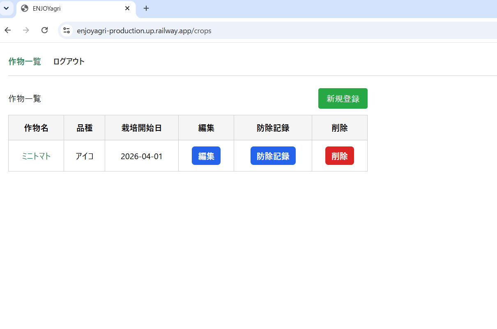
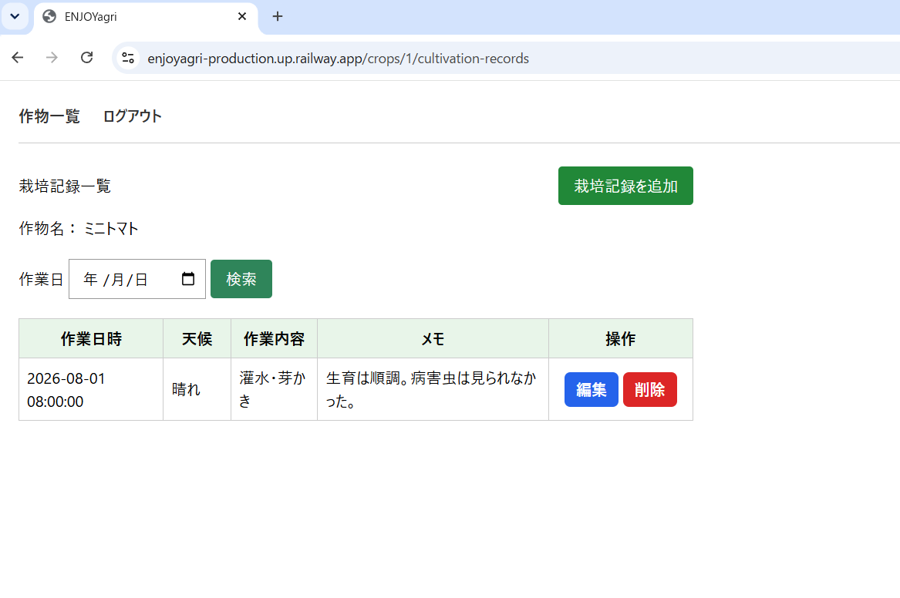
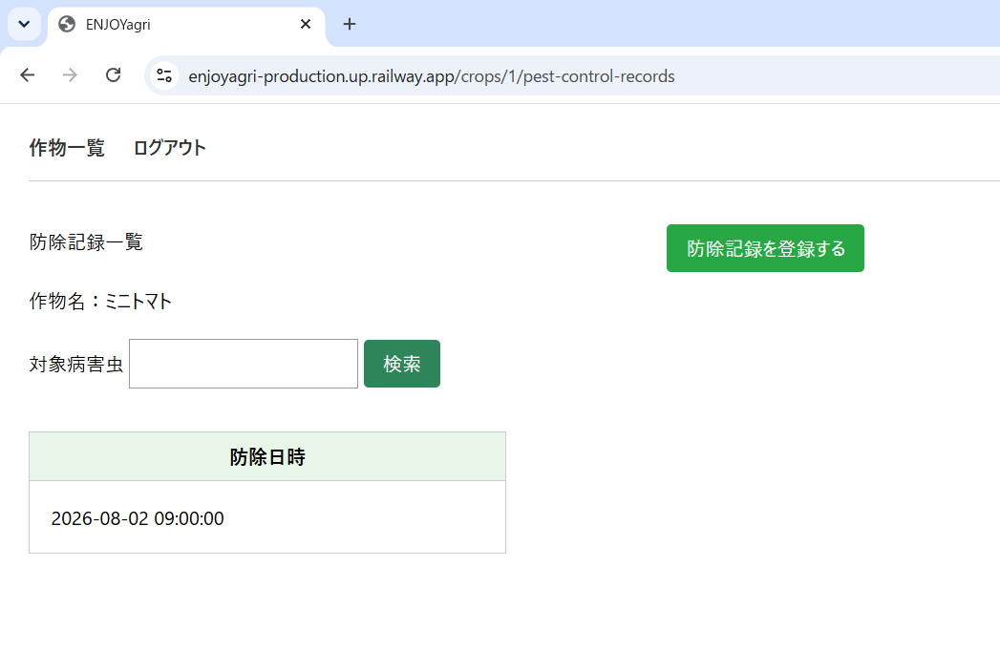

# ENJOYagri

農業初心者が、作物ごとの栽培作業や防除作業を記録・管理できるWebアプリケーションです。

日々の栽培記録を整理し、過去の作業を振り返ることで、農作業の改善につなげることを目的としています。

## 公開URL

https://enjoyagri-production.up.railway.app

## 制作背景

農業大学校で栽培管理に取り組んだ際、日々の管理に多くの時間がかかり、家族との時間や趣味の時間を十分に確保できないという経験がありました。

栽培管理の効率化と栽培品質の向上を目指し、Googleスプレッドシートを使った管理システムを作成しましたが、当時の技術力では、記録した情報を十分に整理・活用できるものにはできませんでした。

この経験から、栽培記録や防除記録を作物ごとに管理し、過去の情報を短時間で振り返ることができる、より使いやすいシステムを開発したいと考え、ENJOYagriを制作しました。

## 主な機能

- ログイン・ログアウト
- 作物の登録・一覧表示・編集・削除
- 栽培記録の登録・一覧表示・検索・編集・削除
- 防除記録の登録・一覧表示・検索・詳細表示・編集・削除
- パソコン・スマートフォンでの表示

## 対象ユーザー

- 新規就農者
- 家庭菜園に取り組む人
- 農業高校・農業大学校などで農業を学ぶ学生

## 使用技術

- PHP
- Laravel
- HTML
- CSS
- JavaScript
- SQLite
- Git・GitHub
- Railway

## 工夫した点

- 作物を起点として、栽培記録と防除記録を関連付けて管理できる構成にしました。
- 日付から必要な栽培記録を検索できるようにしました。
- 対象病害虫から必要な防除記録を検索できるようにしました。
- 防除記録は使用内容を確認しやすいように、一覧画面とは別に詳細画面を設けました。
- パソコンとスマートフォンの両方で操作しやすいように、画面表示やボタンの配置を調整しました。

## デモ用アカウント

- メールアドレス：demo@enjoyagri.com
- パスワード：demo1234

## 画像イメージ

### 作物一覧画面

## 栽培記録一覧画面

## 防除記録一覧画面

## 今後の改善予定

- 売上情報と出荷量を管理する機能
- 栽培記録・防除記録・売上情報を関連付けて確認する機能
- 蓄積した記録を栽培改善に活用するための分析機能

## 開発で苦労した点と解決方法

### 1. 使用技術の選定

初めてのWebアプリケーション開発だったため、目的とする機能を実現するには、どの技術を選び、どのように組み合わせればよいのかという判断に苦労しました。

サーバーサイドの技術を調べる中で、日本のWeb開発ではPHPやRubyなどが広く利用されていることを知りました。その中から、長い利用実績があり、学習教材や情報も豊富なPHPを選択しました。

また、開発に必要な基本機能を効率よく実装するため、PHPのフレームワークであるLaravelを採用しました。データベースには、Laravelが標準で対応しており、別途データベースサーバーを用意せずに利用できるSQLiteを選択しました。

### 2. LaravelにおけるMVCの理解

開発当初は、LaravelのModel・View・Controllerがそれぞれどのような役割を持ち、どのように連携して画面表示やデータ操作を行うのかを理解することに苦労しました。

実際に作物や栽培記録の登録・表示・編集・削除機能を実装する中で、Controllerがユーザーからの要求を受け取って処理を組み立て、Modelを通じてデータベースを操作し、取得したデータをViewへ渡して画面に表示するという流れを学びました。

機能ごとに処理の流れを確認することで、それぞれの役割と、MVCを分けて構成する意味を理解できるようになりました。